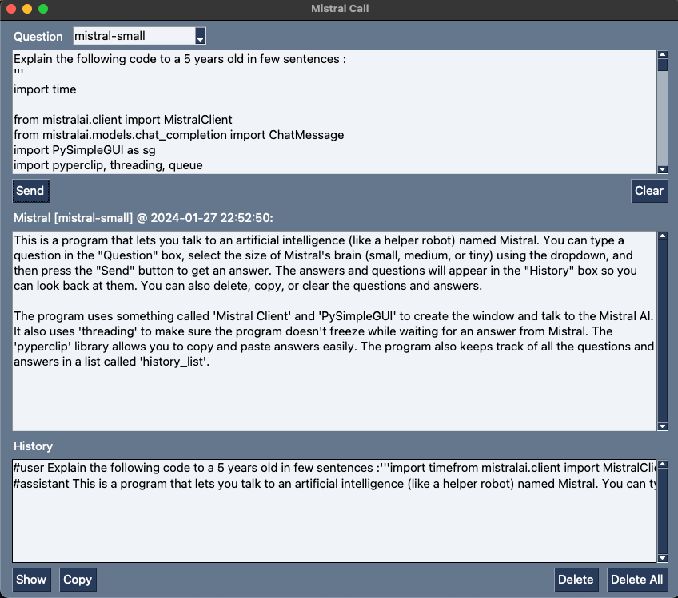

# MistralCall

This is a program that lets you talk to an artificial intelligence (like a helper robot) named Mistral (https://mistral.ai). You can type a question in the "Question" box, select the size of Mistral's brain (small, medium, or tiny) using the dropdown, and then press the "Send" button to get an answer. The answers and questions will appear in the "History" box so you can look back at them. You can also delete, copy, or clear the questions and answers.

The program uses something called 'Mistral Client' and 'PySimpleGUI' to create the window and talk to the Mistral AI. It also uses 'threading' to make sure the program doesn't freeze while waiting for an answer from Mistral. The 'pyperclip' library allows you to copy and paste answers easily. The program also keeps track of all the questions and answers in a list called 'history_list'.

### Notes
- The History is actually sent to the AI to have a conversation and context so it costs tokens, but you can delete some or all lines.
- Very beta state, feel free to commit anything.

## Installation
```
pip install -r requirements
echo 'mistral_api_key' >> .api_key
```

## Run
```
sh mistral.sh 
```


